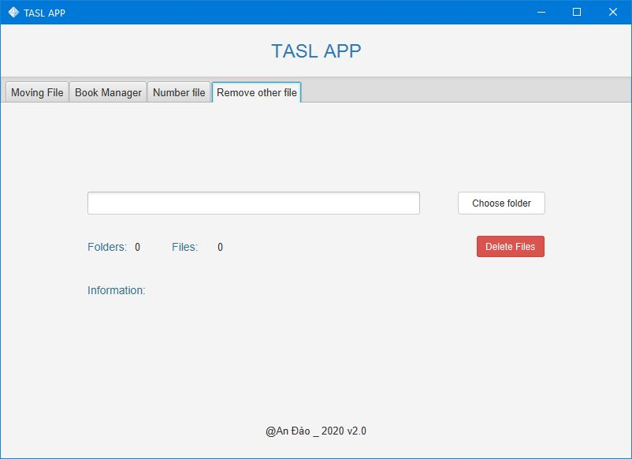
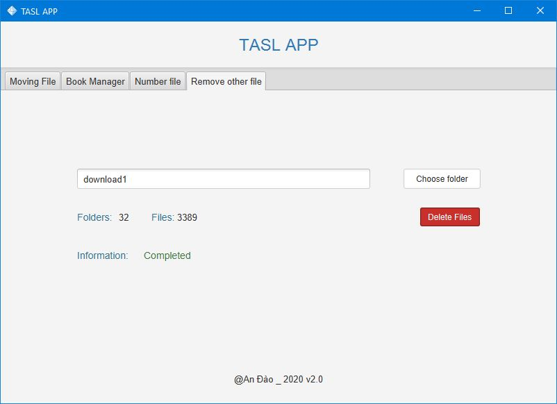

# My App
### Moving File 

---
### Book Manager

---
### Number File

Numbering the file with the prefix 

#### Step
>1. Open choose the folder contains files to rename
>2. Fill the prefix (not necessary)
>3. Click Rename and wait the update information

---

### Remove Other File

Removes files in folder excep image extension (*.jpg, .png, ...*)

##### Step 

>1. Open choose the folder to delete files
>2. Click the delete button
>3. Waiting when information changing
>

##### Images

>*Image 1*

Default Screen

     

    

